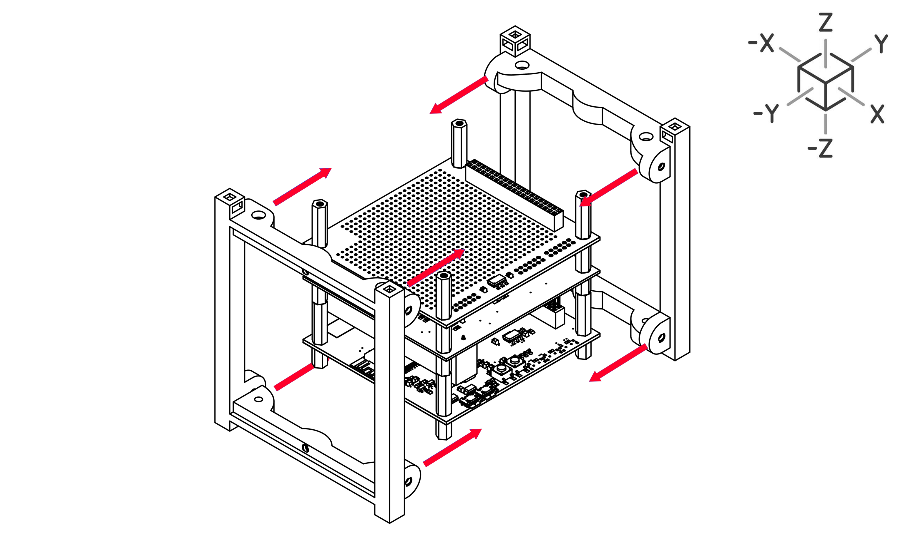

# Assembly Steps
In this section, we will assemble the E-Cube. For this you will need: 1x E-cube set box from Antarikchya Pratisthan Nepal.

## Prerequisites
The first step to E-Cube assembly is soldering the 4 sensors into EPS board. If you haven't already, please head to [Soldering](soldering.md) for this step.

## Understanding Orientation

We shall use the following cartesian axises to define which side of E-Cube we are working on. These axis are also engraved in every PCBs of E-Cube for reference.

For example, the battery-facing side of E-Cube would be -Y axis.

## Identifying Screws
Ecube box contains two seperate types of screws that serve different purposes in ECube assembly.

- Screws for **Holder** (Step 9) are blunt

- Screws for **Acrylic** (Step 10) are sharp

## Assembly
After you have soldered the required sensors into **EPS board**, you can now begin the E-Cube assembly.

### Step 1 

Place four **10mm Male-Female Spacers** at the bottom of **OBC Board**, and tighten it to four **20mm Male-Female Spacers** on the top.

 

### Step 2 

Place four **10mm Female-Female Headers** on all 4 sides, and attach it to the **10mm Male-Female spacers** below. Also place the **40-pin header**.

 

### Step 3 

Align and place the **EPS board**. Also place the provided **Battery** in the battery slot of **EPS Board**.

 

### Step 4 

Attach 4 **15mm Male-Female Spacers** on all four sides.

 

### Step 5 

Align and place the **MSN board**.

 

### Step 6 

Place 4 **20mm Male-Female Spacers** on all of the 4 sides. Screw it on all four sides.

 

### Step 7 

Your structure should look something like this.

 

### Step 8 

Add **Frames** from -Y and +Y axis (as shown).

 

### Step 9 

Screw the frame to the holder using 8 **Spacer-Screws (blunt)**.

 

### Step 10 

Use 12 **Frame Screws (sharp)** to screw in the **Acrylic Panels**.

 

## Identifying Acrylic Panels

The four **Acrylic Panels** of the Ecube are all different from each other. They have specific sizes, holes, and cutouts to properly fit in the **E-Cube**. Use the axis and the refrence below to identify the placement of each **Acrylic Panel**.

### Step 11

Connect the **Deployement Switch** as shown. Use soldering procedure if necessary. Head to [Soldering](soldering.md) for the soldering guide.

 

### Step 12

Screw in the **Deployement Switch** in the **+X acrylic panel** using two screws.

 

### Step 13

Place the solar panel in the **-Y Acrylic Panel** using double sided tapes. Insert the wires through the hole in the Acrylic Panel.

 

### Step 14

The wire connects to the E-Cube in **EPS Board** as shown.

 

### Your E-Cube is ready for Operation

Head towards [Operation Guide]() to use the E-Cube.

