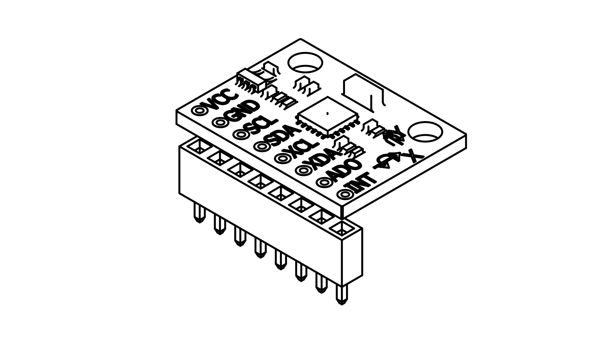
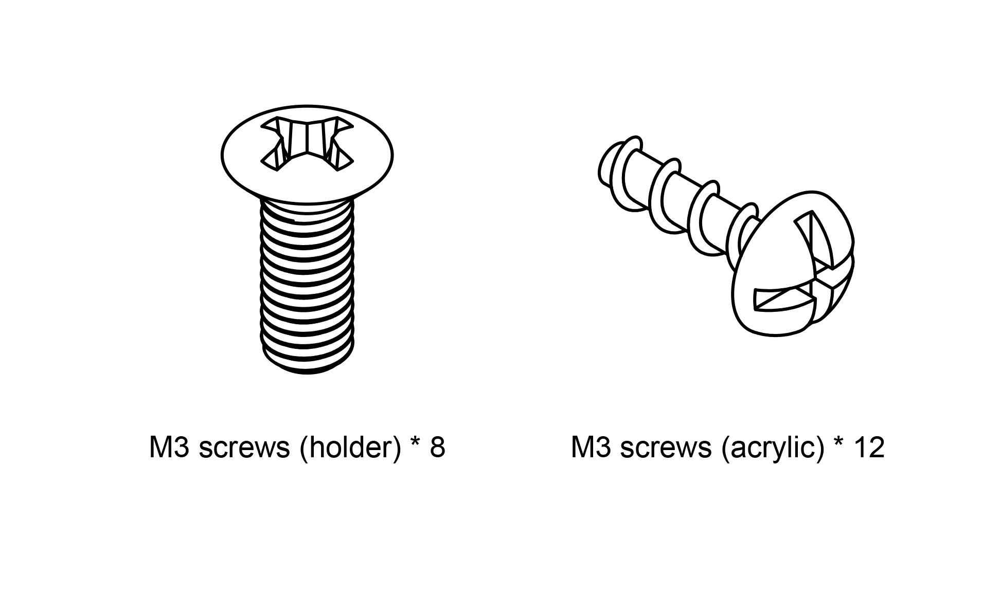
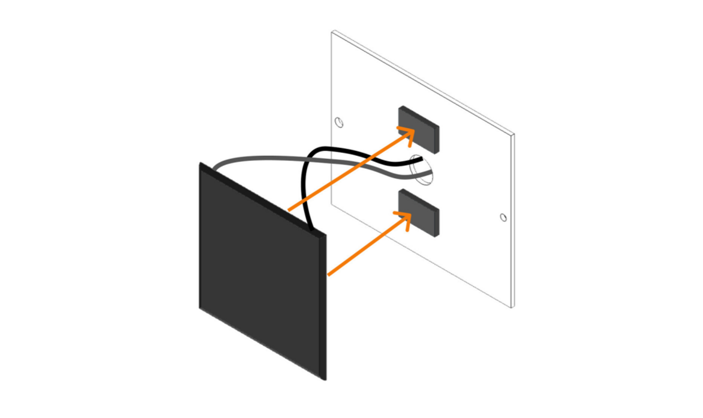

# List of Components
The following set of components are included with 1x ECube Kit.

## Printed Circuit Boards
Printed circuit boards are essential electronic boards that serve as the backbone of ECube. They house crucial components and facilitate communication between different modules.

### 1. On Board Computer (OBC)

On Board Computer (OBC) is the brain of the satellite. It manages data processing, controls various subsystems, and ensures smooth operation of ECube.

### 2. Electrical Power System (EPS)

Electrical Power System (EPS) is responsible for power distribution and regulation. It manages the power supply from solar panels and batteries to ensure stable operation.

### 3. Payload/Mission Board (MSN)

Payload Board/Mission Board is designed to carry out specific experiments or missions. It handles data collection and communication with the OBC.

## Sensor Components

Sensor components are the main data input devices. They read physical data, convert them into digital form, and send it to the OBC for processing.

ECube has 4 main sensors. They are listed as follows:

### 1. GY521 Sensor

GY521 is an accelerometer and gyroscope sensor. It measures linear acceleration and angular velocity, essential for orientation control.

### 2. GY271 Sensor

GY271 is a magnetometer sensor. It detects Earth's magnetic field and helps determine ECube’s orientation in space.

### 3. BMP Sensor

BMP is a barometric pressure sensor. It measures atmospheric pressure, which can be used to estimate altitude.

### 4. DHT11 Sensor

DHT11 is a temperature and humidity sensor. It helps monitor environmental conditions within the satellite.

## Structure

The structure holds and protects all the components of ECube, ensuring stability and durability.

### 1. Frame

The frame is the outer skeleton of ECube. It provides structural integrity and supports all internal components.

### 2. Spacers

Spacers are used to maintain proper alignment and spacing between different PCB layers and components.

### 3. Screws

Screws hold the structure together, ensuring all components are securely fastened in place.

### 4. Acrylic Panels

Acrylic panels serve as protective covers for ECube, shielding internal components from external damage.

## Other Components

### 1. Deployment Switch

The deployment switch detects when ECube is released and triggers system initialization.

### 2. 40-Pin Header

The 40-pin header allows additional components or external modules to be connected to ECube.

### 3. Solar Panel

Solar panels generate power from sunlight, supplying energy to ECube’s electrical system.

## Utilities

Utilities are essential tools and accessories needed for assembling and operating ECube.

### 1. Screwdriver

Use the provided screwdriver for assembling and securing the structural components of ECube.

### 2. USB Cable 

Use the USB cable for programming and powering ECube through a computer or external power source.
