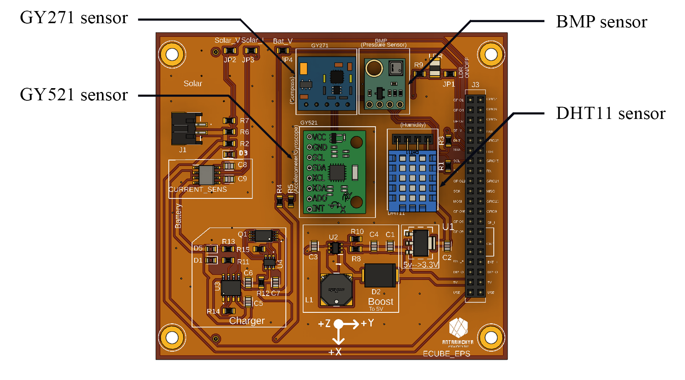
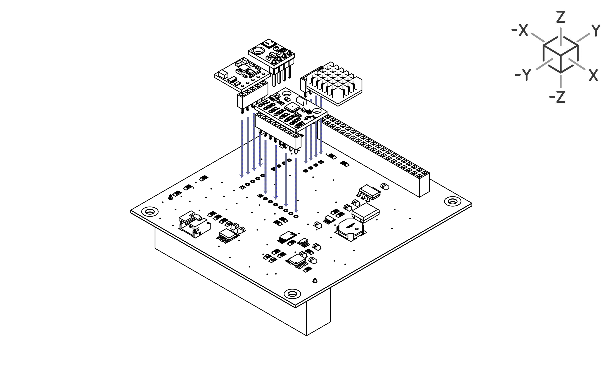
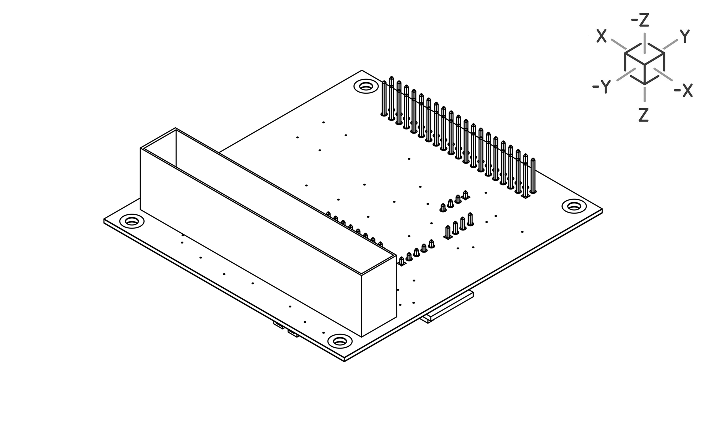
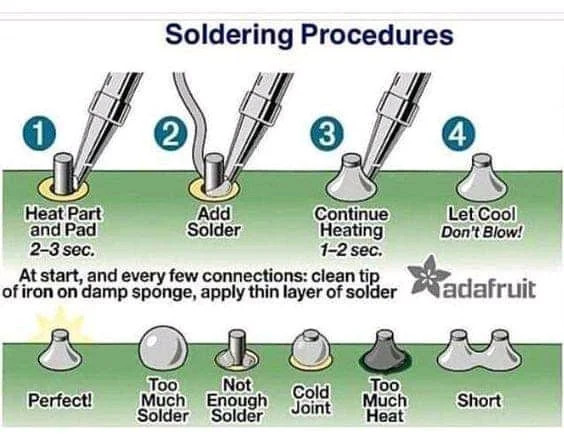

# Soldering Guide

## What is Soldering?

Soldering is a process of joining two or more electronic components together using a filler metal called solder. This technique creates a strong electrical and mechanical connection, making it essential for assembling electronic circuits. Solder typically consists of a combination of tin and lead, though lead-free alternatives are increasingly used for environmental and health reasons.

::: tip
Use a fine-tipped soldering iron for delicate components to achieve better control and precision.
:::

## Safety Warnings

::: warning
Soldering produces fumes that can be harmful if inhaled. Work in a well-ventilated area or use a fume extractor.
:::

::: warning
The soldering iron can reach extremely high temperatures. Always use the soldering stand when not in use, and never touch the tip.
:::

## Preparation

Firstly, gather all the necessary soldering components. Ideally you will require:
- a soldering iron
- soldering wire
- a soldering stand
- power supply for soldering iron

## Sensors Placement

Refer to the following image for the correct placement of the sensors. You will find the corresponding names engraved in the **EPS board** as well.

::: tip
You should notice that the outermost pins in sensors have square pads while the rest of the pins have round pads. The pin with the square pad is referred to as **Pin No. 1**.

You will find square pads in the slots in EPS board as well. This is to highlight the placement of **Pin No. 1**. Make sure that the **Pin No. 1** of sensor aligns with the **Pin No. 1** of the Board while placing the sensor.
:::

::: tip
In correct orientation, the components (small blocks of resistors and capacitors) in sensors are facing upwards.
:::

## Soldering Steps

### 1. Heat the Soldering Iron

Turn on the soldering iron and let it heat up for a few minutes.

   ::: tip
   Always check the soldering iron temperature. For most solder types, a temperature between 350°C and 400°C is effective.
   :::

### 2. Component alignment

Take any one of the sensors. Make sure the pins are aligned properly and are in the correct spot.
 

::: tip
Work on one sensor at a time.
:::

 Flip the Board Backwards. **The soldering is done at the back of the EPS Board.**

### 3. Soldering the Joint

Solder the pins one by one. Some things to keep in mind while soldering:

- Make sure the iron is properly heated before working with it.
- Clean the soldering iron tip before and after use to ensure good conductivity.
- Hold the soldering iron at an angle for better control and visibility.
- Heat the pin and pad simultaneously before applying solder.
- Use the right amount of solder—too much can cause bridges, too little may result in weak joints.
- Avoid excessive heating to prevent damage to components and PCB.
- Work in a well-ventilated area to avoid inhaling fumes.