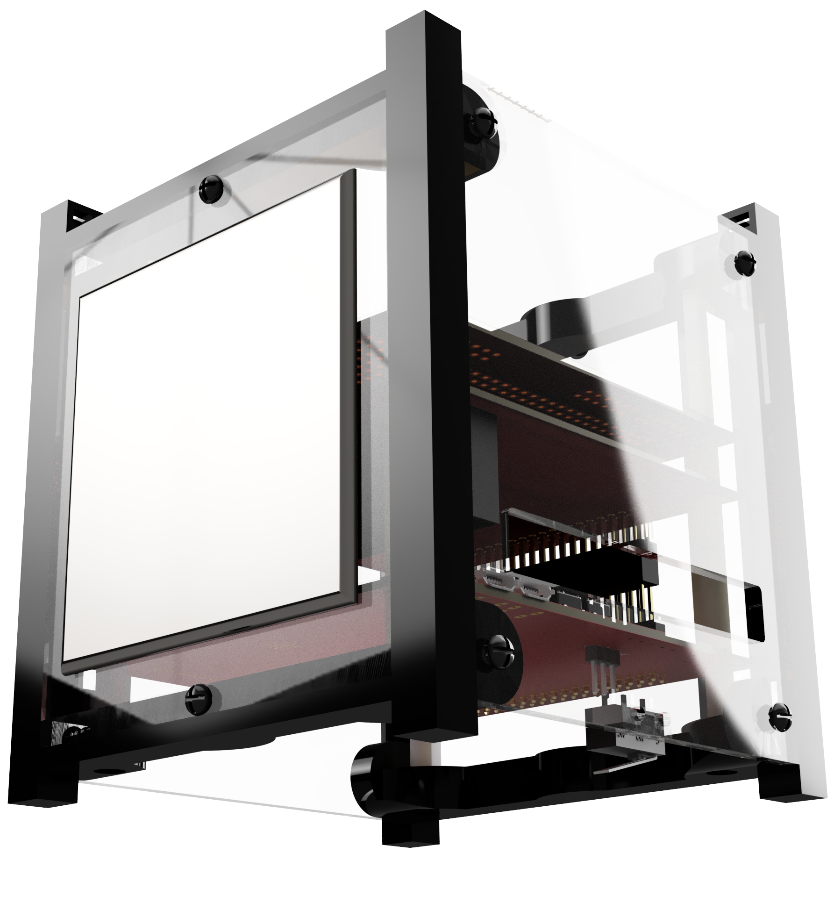

# ECube User Guide

The E-Cube (_Educational Cube_) is an interactive, non-flight replica of a Nano-satellite. With E-Cube, users can explore and learn the form, structure, and workings of a nano-satellite while gathering diverse skills in 3D assembly, soldering, programming, communication, and mission design.

## How Do I Get Started?

It is recommend that all users first read [Background](getting_started/background.md).
It provides an overview and history of Nano-Satellites, its features, advantages, restrictions and a brief introduction to Antarikchya Pratisthan Nepal.

Depending on what you want to achieve, the following tips will help you navigate through this guide:

### I want to assemble the ECube

Refer to [List of Components](assembly/list_of_components.md) for the list of components. The purchased ECube set contains all the necessary components that you need to get started with ECube. 

As a pre-assembly step, ECube requires the users to solder a few sensor components. It is also an important skill in nano-satellite fabrication. Refer to [Soldering](assembly/soldering.md) for the soldering guide.

In the [Assembly Steps](assembly/assembly_steps.md) section, you'll find the detailed instructions to assemble the ECube.

### I wish to learn how to program the ECube

The [Operation Guide](operationguide/index.md) section contains detailed instructions on how to begin writing your first code for ECube. The main microcontroller of E-Cube is **STM32-S3-WROOM-1**. It can be programmed using **Arduino IDE**, or **platform.io** depending on the user's prefrence.

### I wish to design my own missions

The [Hardware Selection & Setup](hardware/drone_parts.md) section should help you on how to get started with your own missions. The **Payload Board (MSN)** facilitates your custom mission design. 

## Getting Help and Reporting Bugs & Issues

If you have any problems or queries, you can write to info.antarikchya@gmail.com

## Contributing

Coming soon

<!--@include: _contributors.md-->

## Certifications

**Certified by Pratt & Whitney Global E-Stem Awards 2024**

&nbsp;
