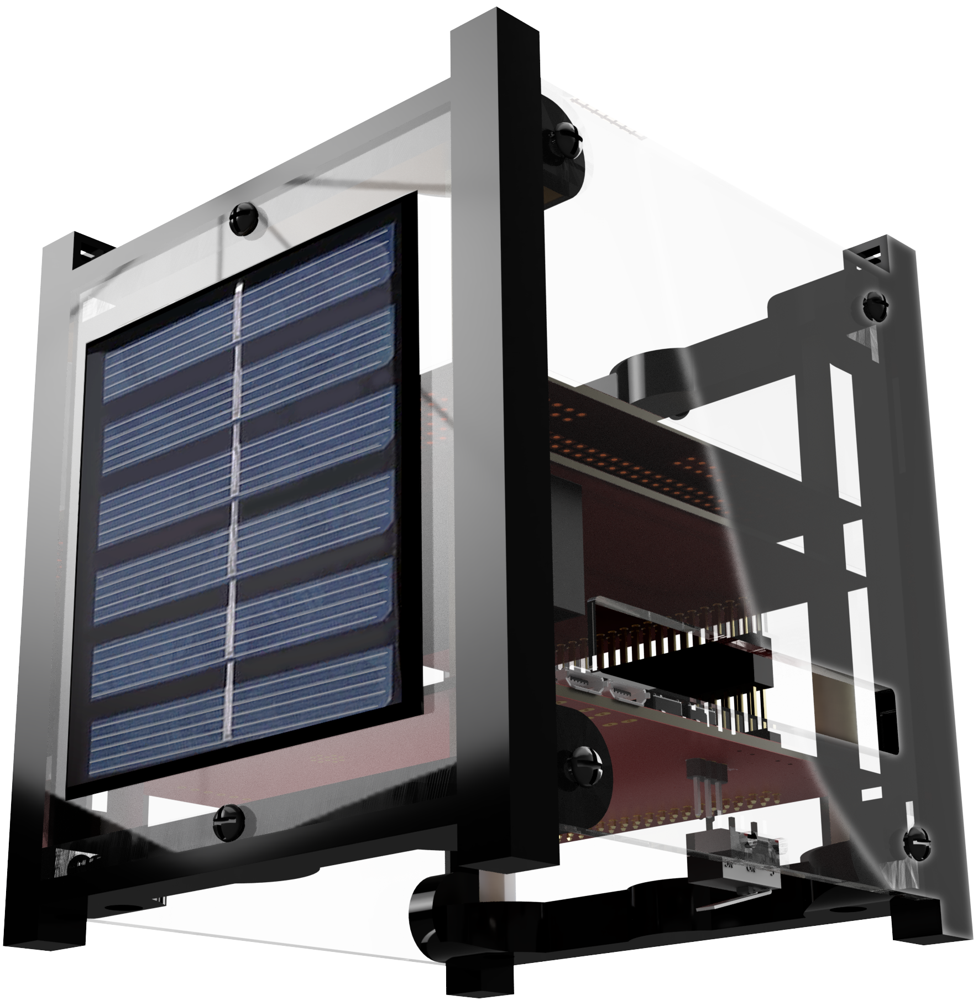

# ECube User Guide

The E-Cube (_Educational Cube_) is an interactive, non-flight replica of a Nano-satellite. With E-Cube, users can explore and learn the form, structure, and workings of a nano-satellite while gathering diverse skills in 3D assembly, soldering, programming, communication, and mission design.

## What is a Nano-Satellite?

<i>A 1U Nano-satellite</i> 

A nanosatellite is a miniature form of satellite with a mass typically ranging between 1 and 10 kilograms. These satellites are designed to perform diverse functions, such as scientific research, Earth observation, communication, and technology validation. Their compact size and advanced design enable them to deliver capabilities comparable to larger satellites while greatly reducing costs.
Nanosatellites often adhere to the CubeSat standard, which defines their structure in modular units of 10x10x10 centimeters. A satellite of this dimension is called a 1U satellite. This standardization enhances cost-efficiency, facilitates streamlined design and manufacturing, and simplifies deployment processes. Due to their affordability and versatility, nanosatellites have become a cornerstone for educational initiatives, innovative research, and commercial applications, democratizing access to space exploration and technology.

## Nepali Sat -1: The First Nano-Satellite of Nepal

<i>Nepali-Sat 1</i> 

E-Cube is inspired by Nepali Sat 1: The First Nano-Satellite of Nepal. Nepal's first satellite, NepaliSat-1, was a 1U CubeSat developed by Dr. Abhas Maskey, the founder of Antarikchya Pratisthan Nepal, under the Birds-3 program at Kyushu Institute of Technology, Japan.

 

# Interfacing with E-Cube

### [List of Components](assembly/list_of_components.md)

<i>
 Refer  for the list of components. The purchased ECube set contains all the necessary components that you need to get started with ECube.  
</i>

### [Soldering](assembly/soldering.md) 

<i>
 As a **pre-assembly step**, ECube requires the users to solder a few sensor components. It is also an important skill in nano-satellite fabrication. Refer to for the soldering guide.
 </i>

### [Assembly Steps](assembly/assembly_steps.md)

<i>
 In the section, you'll find the detailed instructions to assemble the ECube.
</i>

### [Operation Guide](operationguide/index.md)

<i>
 This section contains detailed instructions on how to begin writing your first code for ECube. The main microcontroller of E-Cube is **STM32-S3-WROOM-1**. It can be programmed using **Arduino IDE**, or **platform.io** depending on the user's prefrence.
</i>

### [Jump into action: Upload a pre-written code to E-Cube](operationguide/executingthecode.md)

<i>
 This section helps you upload a pre-written code to E-Cube. Plug. Upload. and Play! Use your E-Cube instantly. 
 </i>

### [Mission Design and Experiments](experiments/index.md)

<i> 
 This  section should help you on how to get started with your own missions. The **Payload Board (MSN)** facilitates your custom mission design.
</i> 

### [Background and Learning](getting_started/background.md)

<i> 
 If you wish to learn more about our work, satellites or satellite history, this section is for you! 
</i>

## Getting Help and Reporting Bugs & Issues

If you have any problems or queries, you can write to info.antarikchya@gmail.com

## Contributing

Coming soon

<!--@include: _contributors.md-->

## Certifications

**Certified by Pratt & Whitney Global E-Stem Awards 2024**

&nbsp;

