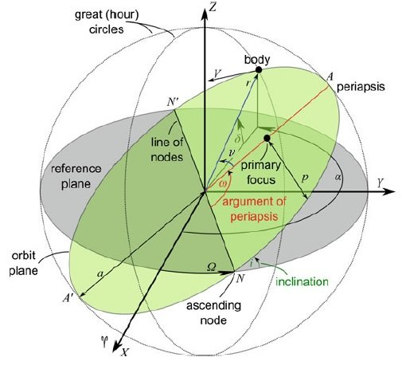

# Orbit

## Introduction

There are different types of CubeSat orbits that can be used for different missions. The altitude, orbital shape, and angle with the equatorial plane are all important parameters that can affect a CubeSat's capabilities and performance. Altitude is a key factor in determining a CubeSat's field of view and ground resolution. A CubeSat in a higher orbit will have a wider field of view but lower resolution, while a CubeSat in a lower orbit will have a higher resolution but a more limited field of view. Inclination is also an important factor in determining a CubeSat's coverage area. A CubeSat in a high inclination orbit will cover a larger geographic area, as it will pass over a greater variety of latitudes. This can be useful for missions that require global coverage, such as Earth observation or weather forecasting. The unique environment of space also provides a wide range of opportunities for scientific research. The microgravity, vacuum, high radiation, ultraviolet radiation, low and high temperatures, and the presence of atomic oxygen and plasma, can be used to conduct experiments in a variety of fields including Earth science, materials science, bioscience, and medical science. The characteristics of space utilization make CubeSats a versatile and cost-effective option for a wide range of missions, and their unique capabilities are continuously expanding as technology and capabilities improve and enhance.

 

   

      Figure 2.1: Graphical representation of all the Keplerian elements ([6]).
   

For a CubeSat's mission to work efficiently, designing an apt orbit is a must. The orbit's characteristics mainly depends on the objective or tasks the satellite needs to accomplish. Hence, an effective orbit lets the engineers to position their satellites accordingly. The basic parameters that help us design an effective orbit are called the Keplerian elements. They are a set of parameters used to describe the orbit of a satellite or celestial body around another object, such as a planet or a star. There are six main Keplerian elements:

  - <b>Semi-major axis (a):</b> This element represents half the length of the longest diameter of
the elliptical orbit. It describes the size of the orbit and determines the average distance
between the satellite and the object it is orbiting.

  - <b>Eccentricity (e):</b> Eccentricity measures the shape of the orbit. It tells us how elongated or
circular the orbit is. An eccentricity of 0 represents a perfect circle, while an eccentricity
closer to 1 represents a more elongated orbit.

  - <b>Inclination (i):</b> Inclination is the angle between the orbital plane of the satellite and a
reference plane, usually the equatorial plane of the object being orbited. It determines how tilted the orbit is with respect to the reference plane.
  
  - <b>Right Ascension of the Ascending Node (Ω):</b> This element represents the angle
between the reference direction (usually the vernal equinox) and the point where the
satellite’s orbit crosses the reference plane from below. It defines the orientation of the
orbital plane in space.

  - <b>Argument of Perigee ( ω )</b> The argument of perigee is the angle between the ascending
node and the point of closest approach to the central object, called the perigee. It defines
the orientation of the satellite within its orbit.

  - <b>Mean Anomaly (M):</b> The mean anomaly represents the angular position of the satellite
along its orbit at a specific point in time. It helps determine the satellite’s position
within its orbit based on time.

By combining these elements, we can precisely define the shape, size, and orientation of
an orbit. These elements are used in orbital calculations, mission planning, and tracking
satellites in space. They are fundamental in understanding the motion and behavior of objects
in our solar system and beyond.
 
