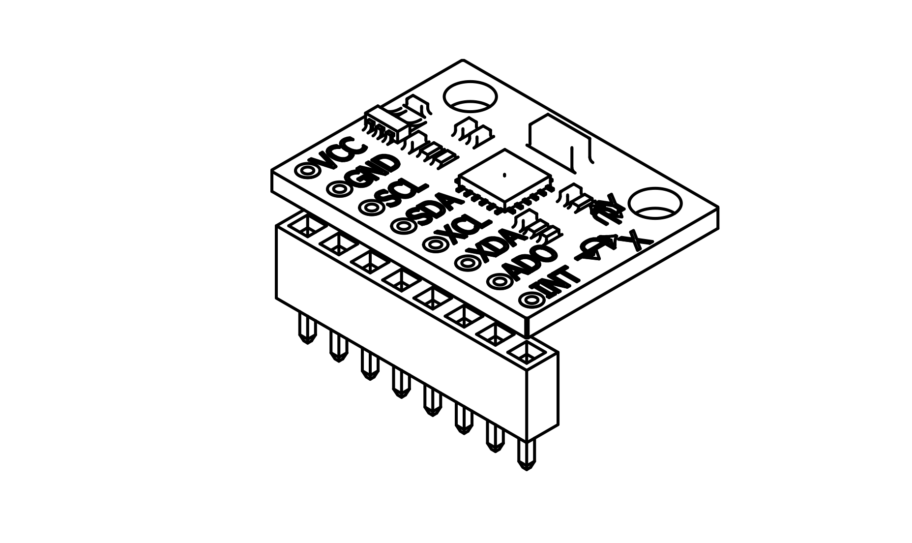
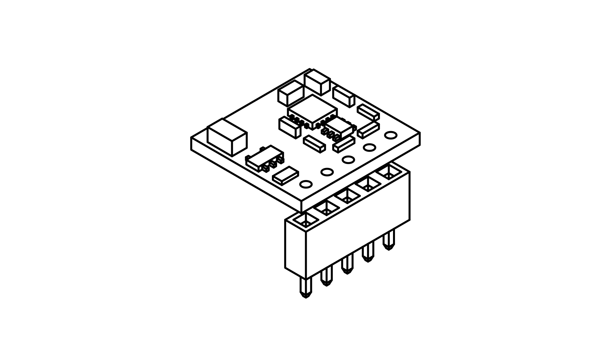
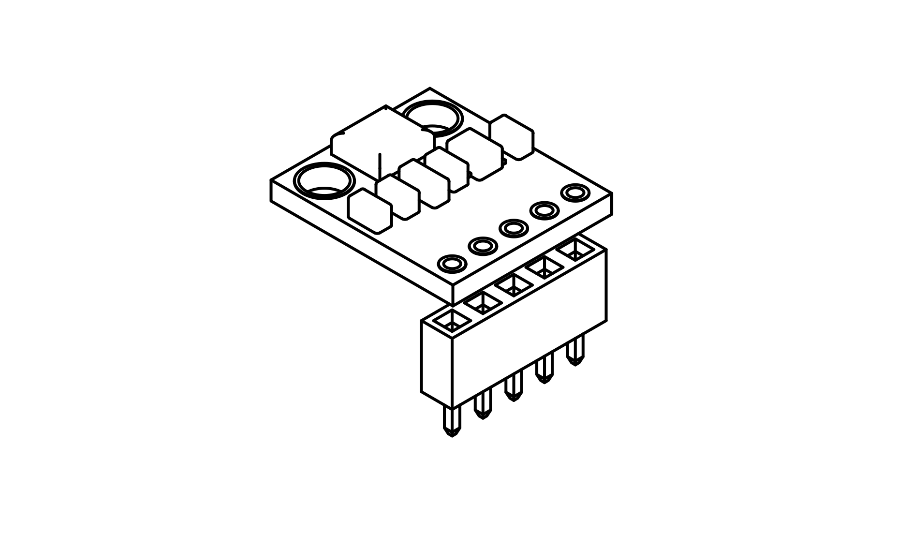
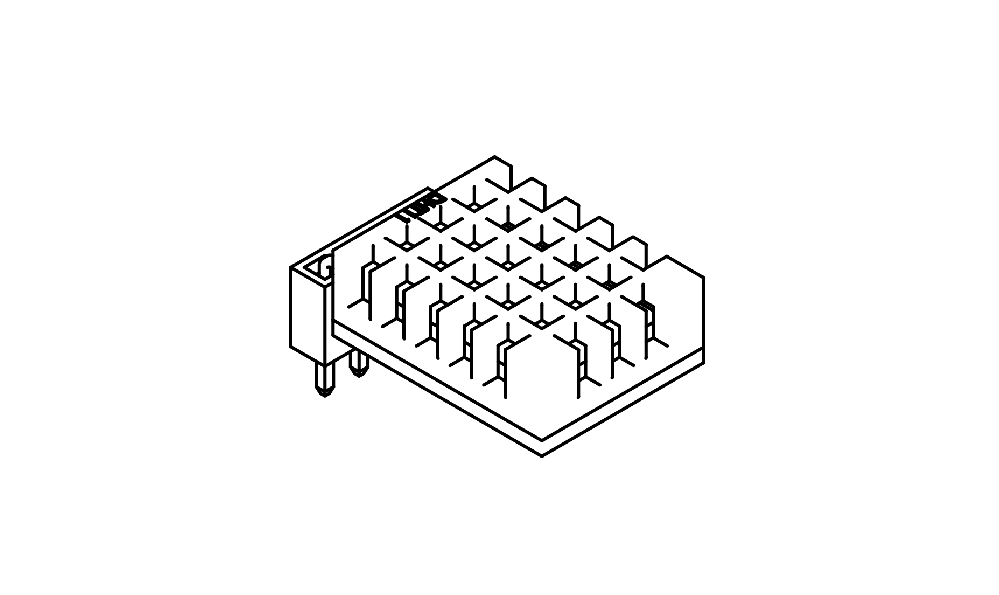

# E-Cube Sensor Guide

This page provides all necessary information about the four sensors included in the ECube kit, how to operate them, the required code, and explanations on how the code works.

## List of Sensors
ECube includes the following four main sensors:

1. **GY-521 (MPU6050) - Accelerometer & Gyroscope**
2. **GY-271 (HMC5883L) - Magnetometer**
3. **BMP180 - Barometric Pressure Sensor**
4. **DHT11 - Temperature & Humidity Sensor**

---

## Required Libraries
Before running the sensor codes, install the following necessary libraries in the Arduino IDE:

1. **MPU6050 Library** (for GY-521)
   ```sh
   Arduino Library Manager: Install "MPU6050 by Electronic Cats"
   ```
   Or manually install from: [MPU6050 Library](https://github.com/ElectronicCats/mpu6050)

2. **Adafruit BMP180 Library** (for BMP180)
   ```sh
   Arduino Library Manager: Install "Adafruit BMP085 Unified"
   ```
   Or manually install from: [Adafruit BMP180 Library](https://github.com/adafruit/Adafruit_BMP085_Unified)

3. **Adafruit HMC5883L Library** (for GY-271)
   ```sh
   Arduino Library Manager: Install "Adafruit HMC5883 Unified"
   ```
   Or manually install from: [HMC5883L Library](https://github.com/adafruit/Adafruit_HMC5883_Unified)

4. **DHT Sensor Library** (for DHT11)
   ```sh
   Arduino Library Manager: Install "DHT sensor library by Adafruit"
   ```
   Or manually install from: [DHT Library](https://github.com/adafruit/DHT-sensor-library)

---

## Sensor Operation and Code

### 1. GY-521 (MPU6050) - Accelerometer & Gyroscope

<div style="text-align: center;"></div>

The (GY521) MPU-6050 IMU (Inertial Measurement Unit) is a 3-axis accelerometer and 3-axis gyroscope sensor. The accelerometer measures the gravitational acceleration and the gyroscope measures the rotational velocity. Additionally, this module also measures temperature. This sensor is ideal to determine the orientation of a moving object.

#### How it Works

The MPU-6050 is a module with a 3-axis accelerometer and a 3-axis gyroscope. The gyroscope measures rotational velocity (rad/s), this is the change of the angular position over time along the X, Y and Z axis (roll, pitch and yaw). This allows us to determine the orientation of an object. The accelerometer measures acceleration (rate of change of the object’s velocity). It senses static forces like gravity (9.8m/s2) or dynamic forces like vibrations or movement. The MPU-6050 measures acceleration over the X, Y an Z axis. Ideally, in a static object the acceleration over the Z axis is equal to the gravitational force, and it should be zero on the X and Y axis.

Using the values from the accelerometer, it is possible to calculate the roll and pitch angles using trigonometry. However, it is not possible to calculate the yaw. We can combine the information from both sensors to get more accurate information about the sensor orientation.

#### Code Example
```cpp
#include <Wire.h>
#include <MPU6050.h>

MPU6050 mpu;

void setup() {
    Serial.begin(9600);
    Wire.begin();
    mpu.initialize();
    Serial.println(mpu.testConnection() ? "MPU6050 connected" : "Connection failed");
}

void loop() {
    int16_t ax, ay, az, gx, gy, gz;
    mpu.getMotion6(&ax, &ay, &az, &gx, &gy, &gz);
    Serial.print("Accel: "); Serial.print(ax); Serial.print(", "); Serial.print(ay); Serial.print(", "); Serial.println(az);
    delay(500);
}
```

### 2. GY-271 (HMC5883L) - Magnetometer

<div style="text-align: center;"></div>

The HMC5883L is a 3-axis magnetometer that measures magnetic fields, often used for compass applications.

The Compass Module (GY271) is designed for low-field magnetic sensing with a digital interface and perfect to give precise heading information. This compact sensor fits into small projects such as UAVs and robot navigation systems. The sensor converts any magnetic field to a differential voltage output on 3 axes. This voltage shift is the raw digital output value, which can then be used to calculate headings or sense magnetic fields coming from different directions. A magnetometer is used for measurement of magnetic field direction in space. Most navigation systems use electronic compasses to determine heading direction. It has several types such as fluxgate, magnetoresistive, magneto-inductive and others.

#### How it Works

Earth’s magnetic field is present in space which points towards the magnetic north. Current carrying conductor also generates a magnetic field around itself. Hence, whenever a current carrying conductor is placed in space, it experiences the effect of the earth’s magnetic field affecting the flow of the electrons through that conductor. These changes in the flow of the electrons are used for identifying the heading or direction of the magnetic field. This is the basic working principle of the magnetometer.

HMC5883L uses a magnetoresistive sensor arranged in a bridge circuit, which is made of nickel-iron (Ni-Fe magnetic film) material. Its electrical resistance varies with the change in the applied magnetic field. The correspondent movement of the nickel-iron material in space experiences earth’s magnetic field which changes the material’s resistance, and hence we get resultant voltage changes across the bridge. This change in voltages is used to get the magnetic field direction in space. The components of Earth magnetic field are parallel to the earth’s surface and are used in determining the compass direction. Only the X and Y components of the earth’s field are used in determining the azimuth angle, or the compass direction.

#### Code Example
```cpp
#include <Wire.h>
#include <Adafruit_HMC5883_U.h>

Adafruit_HMC5883_Unified mag = Adafruit_HMC5883_Unified(12345);

void setup() {
    Serial.begin(9600);
    mag.begin();
}

void loop() {
    sensors_event_t event;
    mag.getEvent(&event);
    Serial.print("Magnetometer: "); Serial.print(event.magnetic.x); Serial.print(", "); Serial.print(event.magnetic.y); Serial.print(", "); Serial.println(event.magnetic.z);
    delay(500);
}
```

### 3. BMP180 - Barometric Pressure Sensor

<div style="text-align: center;"></div>

The BMP180 Breakout is a barometric pressure sensor with an I2C (“Wire”) interface. Barometric pressure sensors measure the absolute pressure of the air around them. This pressure varies with both the weather and altitude. Depending on how you interpret the data, you can monitor changes in the weather, measure altitude, or any other tasks that require an accurate pressure reading.

#### How it Works

The BMP180 is a piezoresistive sensor that detects pressure. Piezoresistive sensors are made up of a semiconducting material (usually silicon) that changes resistance when a mechanical force like atmospheric pressure is applied. The sensor is soldered onto a PCB with a 3.3V regulator, I2C level shifter and pull-up resistors on the I2C pins. This board is 5V compliant – a 3.3V regulator and a i2c level shifter circuit is included so you can use this sensor safely with 5V logic and power. The Sensor has 4 pins, i.e VIN, GND, SDA, SCL Connect the VIN pin to the 5V/3.3V voltage pin, GND to ground, SCL to I2C Clock and SDA to I2C Data of the microcontroller.

#### Code Example
```cpp
#include <Wire.h>
#include <Adafruit_BMP085_U.h>

Adafruit_BMP085_Unified bmp = Adafruit_BMP085_Unified(10085);

void setup() {
    Serial.begin(9600);
    bmp.begin();
}

void loop() {
    sensors_event_t event;
    bmp.getEvent(&event);
    Serial.print("Pressure: "); Serial.print(event.pressure); Serial.println(" hPa");
    delay(500);
}
```

### 4. DHT11 - Temperature & Humidity Sensor

<div style="text-align: center;"></div>

#### How it Works
The DHT11 sensor provides temperature and humidity readings.

#### Code Example
```cpp
#include <DHT.h>

#define DHTPIN 2
#define DHTTYPE DHT11

DHT dht(DHTPIN, DHTTYPE);

void setup() {
    Serial.begin(9600);
    dht.begin();
}

void loop() {
    float temp = dht.readTemperature();
    float hum = dht.readHumidity();
    Serial.print("Temperature: "); Serial.print(temp); Serial.print(" °C, Humidity: "); Serial.println(hum);
    delay(500);
}
```

---

## Understanding the Code
Each sensor requires initializing a library, reading data from the sensor, and displaying it using `Serial.print()`. The delay of 500ms prevents excessive serial output flooding.

---

## Troubleshooting
- **Sensor not detected?** Check wiring and ensure the correct board and port are selected.
- **Incorrect readings?** Ensure the sensor is not in extreme temperature/humidity environments.
- **Compilation errors?** Double-check that the required libraries are installed correctly.

### Also See:

- [Sensor Experiments](/en/experiments/gpiosensor.md)
- [Wireless data from sensors](/en/experiments/wirelessndata.md)
- [More Sensor Experiments](/en/experiments/envnphysics.md)

[Back to Home](./index.md)