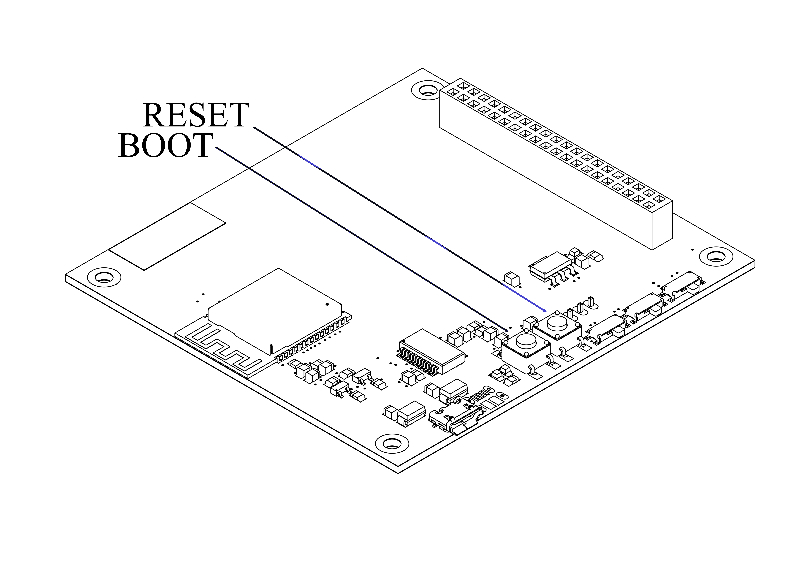

# BOOT & RESET

Boot and Reset buttons are required to be used in special cases while debugging.

## Boot Button (BOOT0)
The Boot Button (BOOT0) is used to select the boot mode of the STM32S3 microcontroller during startup. It determines whether the microcontroller will boot from internal flash memory, System Memory (where the built-in bootloader resides), or SRAM. The default configuration is typically set to boot from flash memory, but by driving this pin high (logic level 1), the device can enter the system bootloader for firmware reprogramming or debugging. This pin should be configured appropriately during product design to ensure correct startup behavior.
The boot button in the e-cube is normally high. (1 when not pressed)

## Reset Button (NRST)
The Reset Button (NRST) is used to reset the STM32S3 microcontroller. When the pin is driven low (logic level 0), the microcontroller is held in a reset state, and its internal registers and peripherals are initialized. Upon releasing the reset pin, the microcontroller will restart and begin execution from the defined start address (typically the reset vector in flash memory). The reset function is essential for recovering from faults, performing system initialization, or re-initiating the device during system upgrades.
The reset button in the e-cube is normally high. (1 when not pressed)
