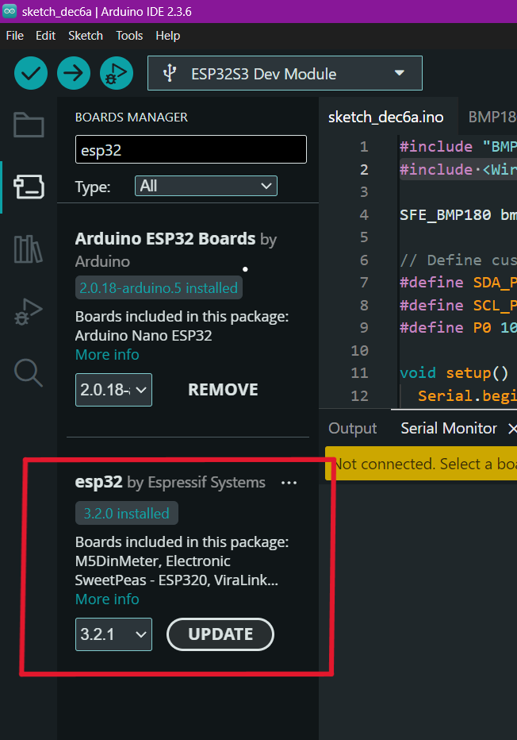
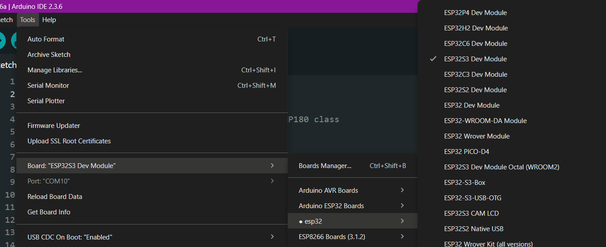

# Setting Up the Integrated Development Environment (IDE)

An IDE is a software application that facilitates programming. Follow these steps to set up the Arduino IDE for E-Cube:

## Step 0 : E-Cube Assembly
 The first and the foremost step for using your E-Cube is assembling it. Head over to [Assembly](/en/assembly/index.md) to assemble your E-Cube.

## Step 1 : Download the Arduino IDE
Visit the [Arduino website](https://www.arduino.cc/en/software) and install the latest version of the Arduino IDE.

<video controls width="640">
  <source src="/public/tutorialIDEinstall.mp4" type="video/mp4">
</video>

### Extract and Install the Software
Follow the installation instructions for your operating system to install the Arduino IDE.

## Step 2: Configure Preferences
1. Open the Arduino IDE.
2. Go to **File > Preferences**.
3. In the **Additional Board Manager URLs** section, paste the following link:
   ```
   https://raw.githubusercontent.com/espressif/arduino-esp32/gh-pages/package_esp32_index.json
   ```


## Step 3: Install ESP32 Board Package
1. Navigate to **Tools > Board > Board Manager**.
2. Search for **"ESP32 by Espressif Systems"**.
3. Click **Install** to install the package.

<div style="text-align: center;"></div>

## Step 4: Select the Board and Port
1. Go to **Tools > Board > ESP32 Arduino > ESP32S3 Dev Module**.
2. Ensure the **"USB CDC on Boot"** feature is enabled.

<div style="text-align: center;"></div>


### Select the Port
1. Connect your ESP32S3 Dev Module to your computer via USB.
2. Open the Arduino IDE and go to **Tools > Port**.
3. Select the appropriate COM port (e.g., **COM3** or **/dev/ttyUSB0** for Linux/macOS).
4. If no port appears, ensure drivers for your ESP32 board are installed.

### Debugging: If No Port Appears
If no port appears, try the following troubleshooting steps:
- Ensure you are using a **data USB cable** (some cables are power-only and won't work for communication).
- Install the necessary **USB-to-serial drivers** for your board (e.g., **CP210x** or **CH340** drivers, depending on your ESP32 model).
- Restart your Arduino IDE and reconnect the board.
- Try a different USB port on your computer.
- Check **Device Manager (Windows)** or **ls /dev/ttyUSB* (Linux/macOS)** to see if the board is detected.
- Press the **BOOT** button on the ESP32S3 module while connecting it.

## Step 6: Configuring the Tools Section

The following options in the tools section of Arduino IDE are recommended for ECube.
<div style="text-align: center;"></div>

Your Arduino IDE is now set up for E-Cube programming! 

### You can now head over to [Executing the Code](/en/operationguide/executingthecode.md) to upload your first code to E-Cube.


[Back to Home](./index.md)