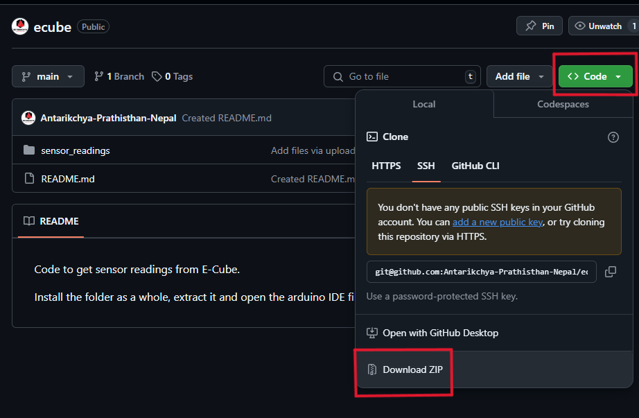
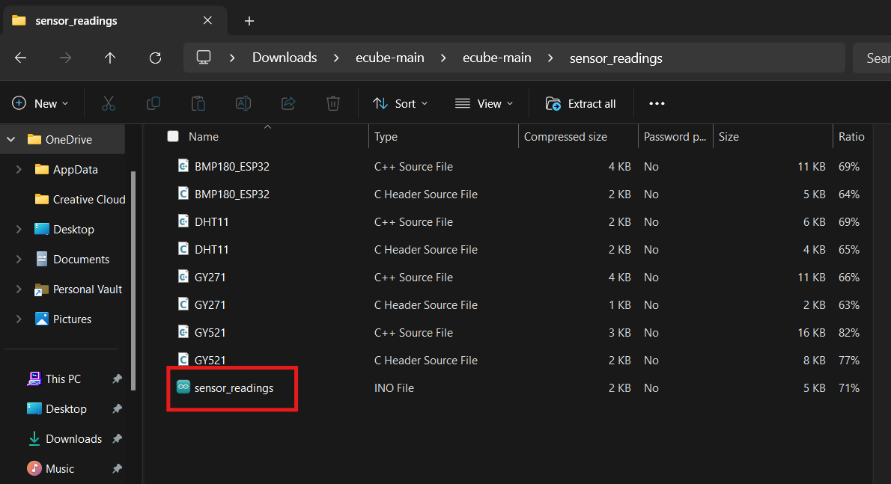
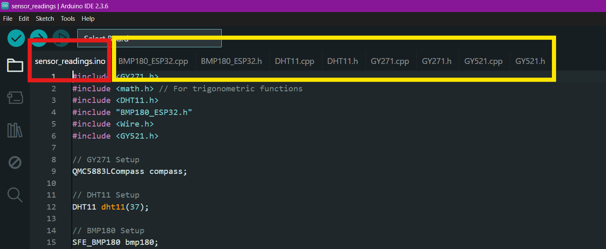

# Executing the Code

In this section, we will test our E-Cube by running a pre-written code for E-Cube. 

## Step 0: E-Cube Assembly

 The first and the foremost step for using your E-Cube is assembling it. Head over to [Assembly](/en/assembly/index.md) to assemble your E-Cube.

## Step 1: Environment Setup
Before Programming, Make sure you have properly setup the environment from [Environment Setup](environmentsetup.md).

This includes setting up Arduino IDE, Board Prefrences and options in the Arduino IDE.

Connect the E-Cube to your PC using the USB Cable provided.

## Step 2: Code Download

Download the ECube Code from the [Antarikchya GitHub](https://github.com/Antarikchya-Prathisthan-Nepal/ecube/tree/main)

### a) Follow the link
### b) Press on the green `code` button
### c) Press on Download ZIP

### d) Extract the code

 Open "sensor_readings.ino" .

::: danger Caution
**Do not RENAME, MOVE, OR CHANGE any files in this folder. The .ino file should have the exact name as the folder that contains it.**
:::

This is a pre-written code for E-Cube. When you open the file, it should directly open the installed Arduino IDE. 

When you open the sensor.ino file, all the other source (.c) and header (.h) files will open automatically in multiple tabs.

The sensor.ino file is your main file. This is the file that you will upload in the ecube. Select this tab.

## Step 4: Running the code

Reminder: head to [Environment Setup](environmentsetup.md) for the setting up environment guide before running the code.

### a) Select the Board and Port
1. Go to **Tools > Board > ESP32 Arduino > ESP32S3 Dev Module**.
2. Go to **Tools > Port** and select the port where your E-Cube is connected
2. Ensure the **"USB CDC on Boot"** feature is enabled.

The following options in the tools section of Arduino IDE are recommended for ECube.

Upload the code. Look out for the `done uploading` message in terminal.

## Step 5: Once Your Code is Uploaded
After successfully uploading your code, you can monitor the output using the Serial Monitor or Serial Plotter.

### a) Opening the Serial Monitor
1. Use the shortcut **Ctrl + Shift + M** (Windows/Linux) or **Cmd + Shift + M** (Mac).
2. Alternatively, go to **Tools > Serial Monitor** in the Arduino IDE.
3. Ensure the correct baud rate (e.g., **115200**) is selected to match the one in your code.
4. Observe the printed output in real-time.

### b) Using the Serial Plotter
1. Open the Serial Plotter with **Ctrl + Shift + L** (Windows/Linux) or **Cmd + Shift + L** (Mac).
2. Alternatively, go to **Tools > Serial Plotter**.
3. The Serial Plotter graphically represents numerical data sent via `Serial.println(value)`, making it useful for sensor data visualization.
4. Ensure values are properly formatted in your code to avoid display issues.

Toggle between different options at the header to isolate and observe specific readings from the sensor. 

### Also See:

- [Environment Setup](/en/operationguide/environmentsetup.md)
- [Boot and Reset](/en/operationguide/bootnreset.md)
- [Switches](/en/operationguide/switches.md)

[Back to Home](./index.md)