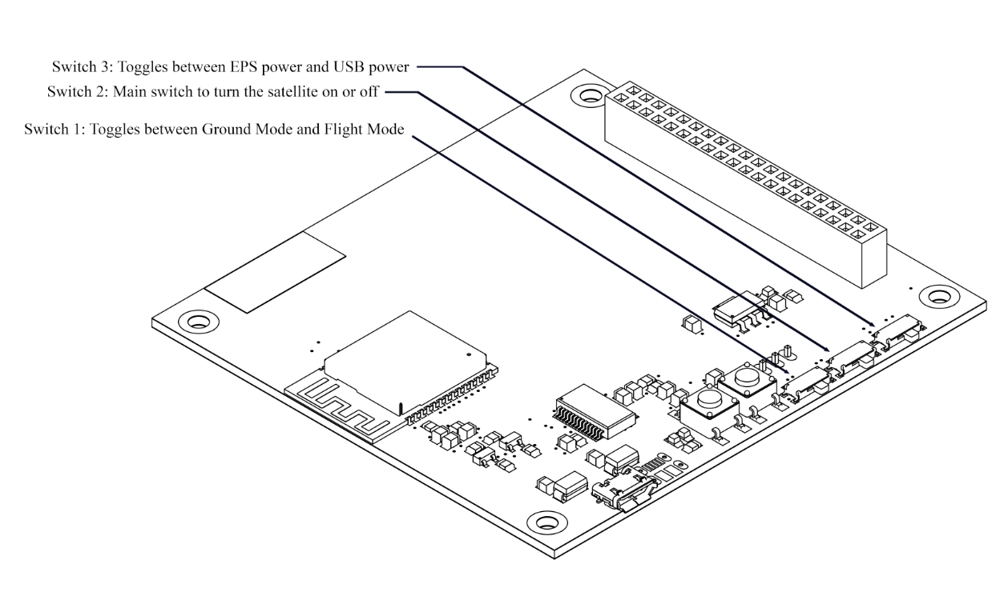

# Switches

The Onboard Computer (OBC) Board has three switches, which allow the user to customize the satellite's power distribution.

The ECube features a release detection switch with two modes: **Ground Mode** and **Flight Mode**.

- In **Ground Mode**, power is transmitted to the E-cube when the deployment switch is pressed.

- In **Flight Mode**, power is transmitted to the E-cube when the deployment switch is released.

### Switch 3 toggled to EPS power mode
The power to the E-cube is provided by the battery attached to the EPS board. Use this mode when using E-cube wirelessly. 

### Switch 3 toggled to USB power mode
In this mode, the power for the satellite is provided by a USB wire in the OBC board. Use this mode when uploading codes.

### Also See:

- [Environment Setup](/en/operationguide/environmentsetup.md)
- [Boot and Reset](/en/operationguide/bootnreset.md)
- [Executing the code](/en/operationguide/executingthecodes.md)

[Back to Home](./index.md)