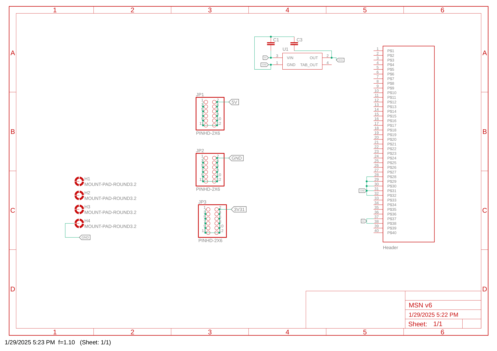
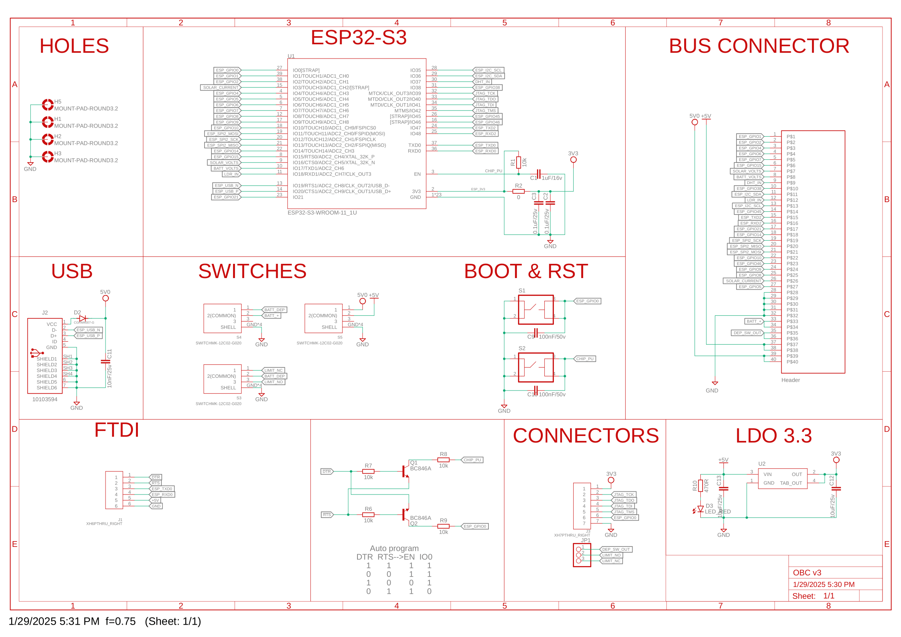
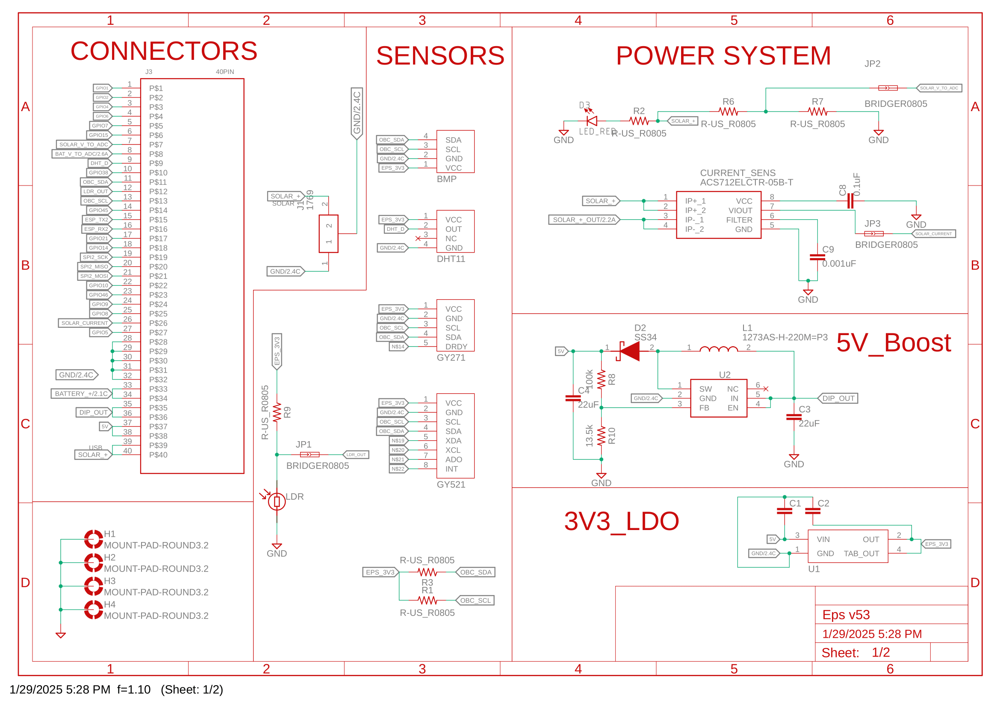
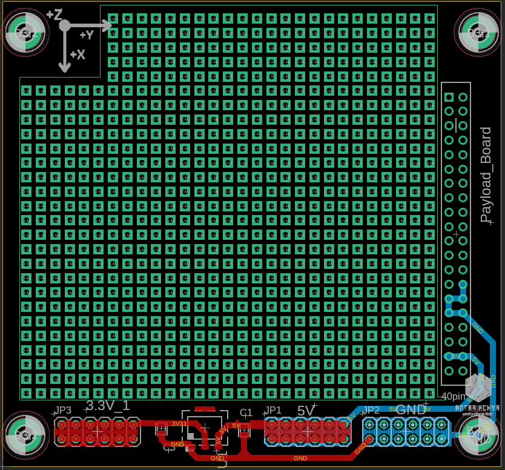
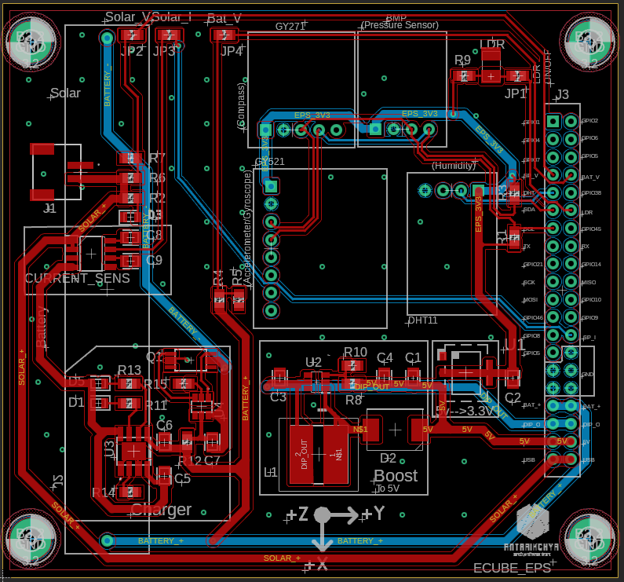
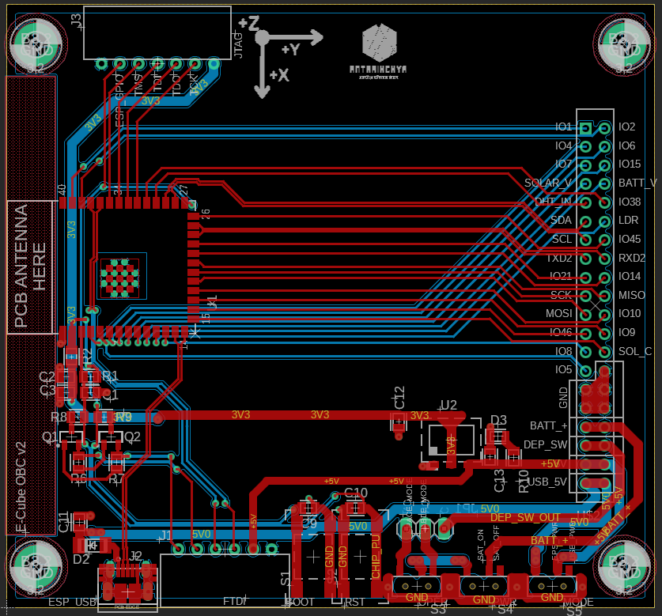

# Schematics and Layouts

## Payload/Mission Board (MSN) Schematic

## Electrical Power System (EPS) Schematic

## On Board Computer (OBC) Schematic

## Payload/Mission Board (MSN) Layout

## Electric Power System (EPS) Layout

## On Board Computer (OBC) Layout

